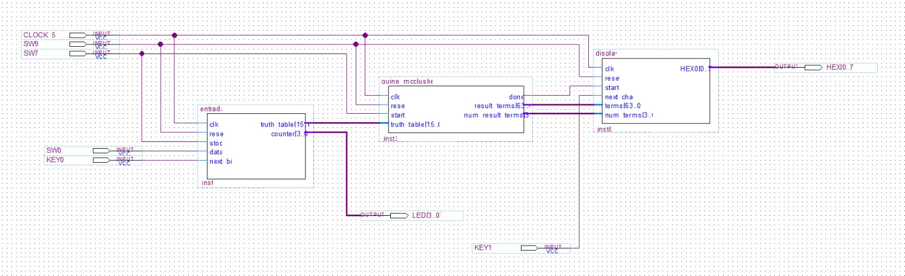

# Implementação em FPGA do Algoritmo de Quine-McCluskey

Este projeto consiste na implementação de um sistema digital em uma placa FPGA DE10-Lite que resolve o problema de minimização de funções booleanas de 4 variáveis utilizando o algoritmo de Quine-McCluskey. O sistema é interativo, permitindo a entrada de uma tabela-verdade via chaves e botões, e exibe a expressão booleana mínima resultante em um display de 7 segmentos.

## Diagrama de Blocos
A arquitetura do sistema é modular, facilitando o desenvolvimento e a depuração. A entidade de topo (`Top.vhd`) integra os módulos de entrada, processamento e exibição.

## Funcionalidades

- **Minimização de Funções Booleanas:** Implementa o algoritmo de Quine-McCluskey completo para funções de 4 variáveis.
- **Entrada de Dados Interativa:** Permite inserir os 16 bits da tabela-verdade sequencialmente usando uma chave e um botão.
- **Feedback Visual:** LEDs indicam o progresso da entrada de dados e o status da computação.
- **Exibição em Carrossel:** O resultado (a expressão mínima) é exibido caractere por caractere em um display de 7 segmentos, navegável através de um botão.
- **Representação de Negação:** A negação de uma variável é representada pelo acendimento do ponto decimal do display.

## Hardware e Software

- **Hardware:** Placa FPGA DE10-Lite.
- **Software:** Intel Quartus Prime.
- **Linguagem:** VHDL.

## Estrutura do Projeto

O projeto é composto pelos seguintes módulos VHDL:

- **`Top.vhd`**: Entidade de mais alto nível que conecta todos os módulos e os mapeia para os pinos físicos da FPGA.
- **`entrada.vhd`**: Gerencia a interface com o usuário para a inserção da tabela-verdade.
- **`quine_mccluskey.vhd`**: O núcleo do projeto. Contém a complexa máquina de estados que executa o algoritmo de minimização.
- **`display.vhd`**: Converte o resultado bruto do algoritmo em uma sequência de caracteres legíveis e controla a exibição no display de 7 segmentos.

## Como Usar

1.  **Reset:** Para reiniciar o sistema, mova a chave `SW9` para '1' e retorne a '0'.
2.  **Entrada da Tabela-Verdade:** Para cada um dos 16 bits (do mintermo 0 ao 15):
    - Coloque o valor do bit na chave `SW0` ('0' para baixo, '1' para cima).
    - Pressione e solte o botão `KEY0`.
    - Os LEDs `LEDR[3..0]` indicarão o índice do próximo bit a ser inserido.
3.  **Iniciar Processamento:** Após inserir os 16 bits, levante a chave `SW7` para '1'.
    - O `LEDR[8]` acenderá, indicando que o algoritmo está em execução.
4.  **Ver o Resultado:** Ao final do processo, `LEDR[8]` apagará.
    - O display `HEX0` mostrará o primeiro caractere da expressão mínima.
    - Pressione `KEY1` repetidamente para navegar pela expressão no modo "carrossel".

## Melhorias Futuras

- **Ativação Robusta:** Mudar a lógica de início para um modelo de "habilitação + gatilho", onde `SW7` arma o sistema e um aperto de botão (`KEY1`, por exemplo) inicia o cálculo, aumentando a confiabilidade.

## Autor

- **Fernando Frare Vieira** - https://github.com/FernandoFrareVieira 